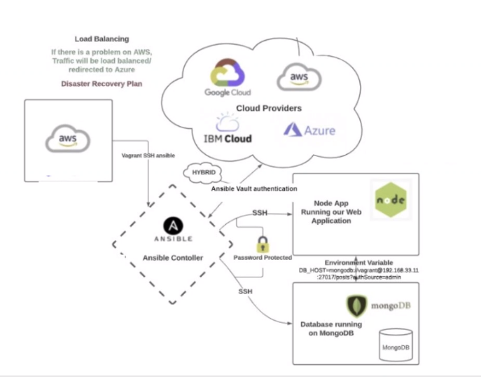

## Ansible
- open-source automation tool
- used for configuration management (see below), application deployment and task automation

Diagram below:

#### Diagram explained:
1. AWS Cloud provider is SSH connected to Ansible 
2. SSH connect to App
3. SSH connect to MongoDB 
2. Ansible allows you to setup resources from multiple cloud providers (hybrid cloud setup)
3. 

## What is What is Configuration Management
- refers to the process of managing and controlling the configuration of software systems or infrastructure
- involves tracking and maintaining the state of various components, settings, and dependencies that make up a system.
- helps ensure consistency, reliability, and reproducibility of software deployments.

#### Software Development
- involves tasks like version control, managing dependencies, and automating deployment process. 
- helps developers collaborate effectively, track changes, and roll back to previous versions if needed.

#### Infrastructure Management
- involves managing the configuration of servers, network devices, and other infrastructure components. 
- includes tasks like provisioning, monitoring, and ensuring consistency across different environments.

## What is Orchestration
- coordination and management of multiple tasks, processes, or components to achieve a desired outcome
- organizing and sequencing various activities in a way that they work together harmoniously.

#### Software Development
- the automation and coordination of complex workflows or deployments. 
- involves managing the execution of multiple tasks, services, or systems to achieve a specific goal or outcome. 
- tools and frameworks help streamline and automate these processes
- ensure efficient and reliable execution.

## Orchestration with Terraform
- Orchestration with Terraform - refers to  process of automating and managing the deployment, configuration, of complex infrastructure and applications using Terraform, an open-source infrastructure as code (IaC) tool
#### what is Orchestration with Terraform
- Terraform allows you to define and automate the provisioning of infrastructure components e.g. VMs
-  handles dependencies between infrastructure components, ensuring that resources are provisioned in the correct order to avoid conflicts and errors.
-  maintains a state file that keeps track of the current state of the deployed infrastructure.

#### where is Orchestration with Terraform used
- Cloud Environments
- on-premises data centres
- Multi-cloud deployments
- Development and Testing environments

#### Why is is used?
- Infrastructure as Code: Terraform enables the principles of IaC, allowing infrastructure to be version-controlled, tested, and treated like software code. This improves collaboration and repeatability.
- Scalability: It allows for easy scaling of infrastructure
- Collaboration: Terraform configurations can be shared and collaborated on within teams

#### when is it used?
- Disaster recover
- Compliance and Security
- New infrastructure deployment
- Infrastructure updates

#### How is it used
- Write Terraform configuration describing the desired infrastructure.
- Initialise Terraform terraform init
- terraform plan to create an execution plan
- Apply changes terraform apply